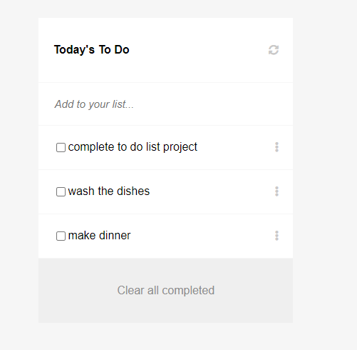

# To do list

> One paragraph statement about the project.

Additional description about the project and its features.

## Built With

- HTML
- CSS
- Javascript
- Webpack

## Getting Started

To get a local copy up and running follow these simple example steps.
[git@github.com:Fikerte-T/to-do-list.git](git@github.com:Fikerte-T/to-do-list.git)

## Authors

👤 **Fikerte Tesfaye**

- GitHub: [@githubhandle](https://github.com/githubhandle)
- Twitter: [@twitterhandle](https://twitter.com/twitterhandle)
- LinkedIn: [LinkedIn](https://linkedin.com/in/linkedinhandle)

## 🤝 Contributing

Any feature requests and contributions are welcome!!

Check the issues page [here](https://github.com/Fikerte-T/to-do-list/issues).

## Show your support

Give a 👍 👍 if you approve this project!

## Acknowledgments
- Standup team
- Morning session team

## 📝 License

This project is [MIT](./MIT.md) licensed.
